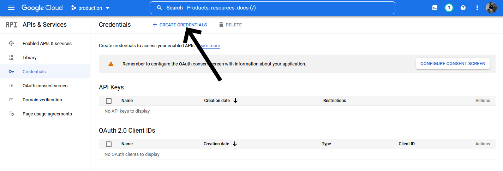
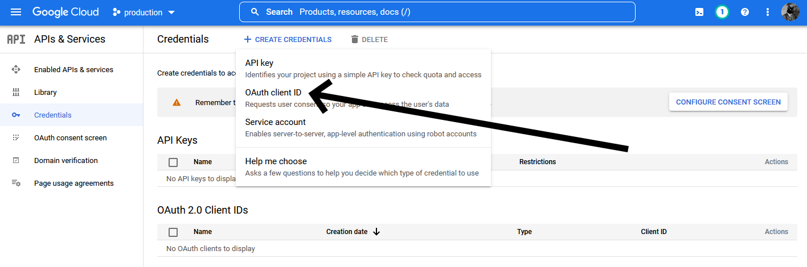
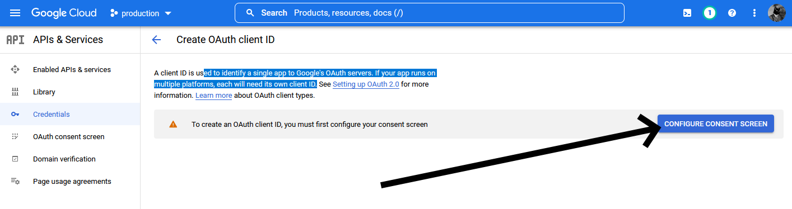
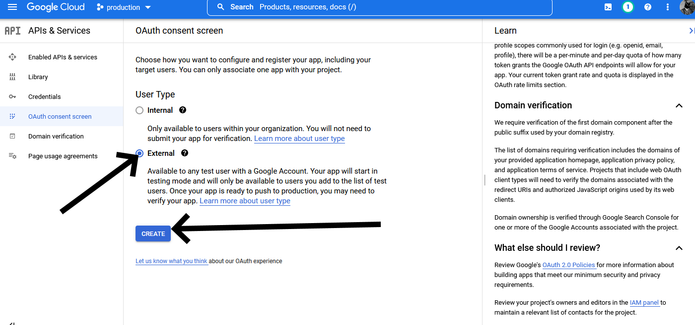

# aws-serverless-auth-with-google
An example repo on how to do OAuth OIDC authentication with google by using a serverless application on AWS

# Prerequisites
- Register your domain
- Setup the following pages
  - Pick an app name
  - Setup a support email
  - Make a logo
  - Create a homepage
  - Create a page that displays your privacy policy
  - Create a page that displays your terms of service link

# Register your app

Go to https://console.cloud.google.com/apis/credentials?project=nifty-field-257001 to register your app

Or maybe it's here? 
https://developers.google.com/identity/gsi/web/guides/overview

Fill out all the information in this page. There is a drop down menu for the user support email and I don't know how to get the right email in there. 

Scopes:
I don't know what scope you need. I left it blank.

Test users:
Prior to validation you have to explicitly list the users here. You cannot use the primary email account as a test user.

